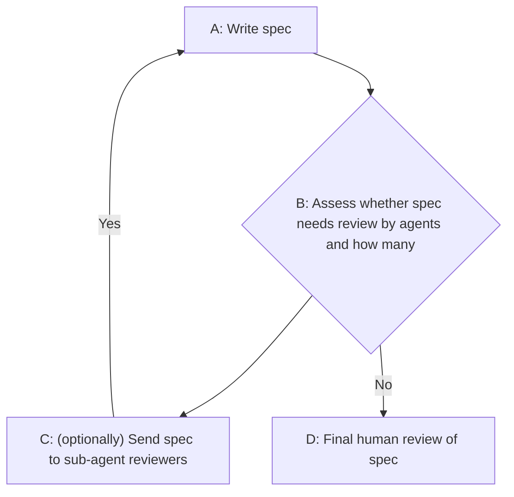
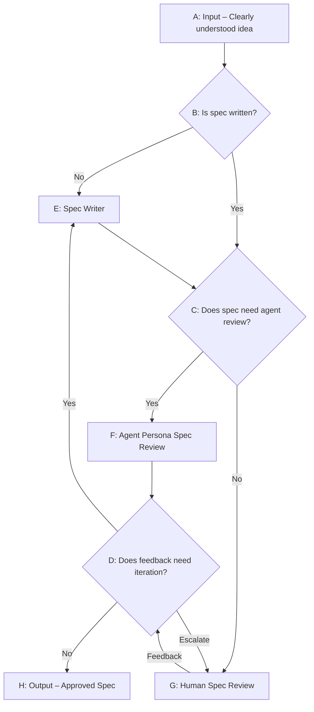

<Image src="/posts/images/multi-agent-spec-review.jpg" className="rounded-lg" alt="Image of remote agents collaborating"/>

# Introduction

<GitHubRepoCard
  repo="ky1ejs/claude-plugins"
  description="The skills described in this post are available in this repo"
/>

I recently had a good time using sub-agents to prevent context-rot and introduce diverse perspectives when coding with agents.

**This post shares an approach to boost your results when following spec-driven development with AI agents by introducing multi-agent spec review.**

My goal with this post is to help others play with sub-agents, spec-driven development and context window management to get better results with AI-assisted software development. I'd love to connect with you if you find this interesting (my socials etc. are on the home page).

# Where it started...
Over the past few weeks, I've become obsessed with spec-driven development.

Essentially, spec-driven development is Claude Code plan mode taken up a notch. 

Today (January 20, 2026), Claude will actually write a spec of sorts whenever you plan. Typically, spec-driven development with Claude gives the opportunity to be a lot more detailed and consistent across all of your plans and specs, which is great for reaching a deterministic workflow.

> [!NOTE] Why are people obsessed with being deterministic with AI?
>  Well, AI is very exciting, but every time you open a context window, it's like speaking to a new who works at the same company; the ideas/outcomes you'll arrive at will vary widely depending on how that person (agent) happens to interpret things on that day.
>
>  While we often want an agent to be creative, we also often want a session of work to arrive at some level of consistency in approach, criticality and thoroughness. Without that bar being guaranteed, it becomes less appealing to use AI for serious work, since it feels like a dice roll every time you start a new session.

# The Problem
After enjoying collaboratively writing specs with Claude, I started to get bored of the slowness of co-authoring every section of the spec. I thought to myself, I wish I could just trust Claude to write the whole thing and then I review specifics... how can I get to that point?

The value I saw in me reviewing Claude's work, aside from me knowing what is going on in the codebase (which is critical), is that I bring a fresh set of eyes and diversity of thought... I can also sense-check when the session is being too kind and appeasing the approach I want to see rather than challenging me on good grounds.

That's when I realized, what if I created multiple sub-agents with separate personas who only received the written spec with no steer from the conversation I've had with Claude prior to writing the spec, so they could review it purely on the grounds of the written spec and its own persona...

# The Solution: spec-orchestration with sub-agents
To realize this future of multi-persona, fresh-eyed spec review and iteration, I created a `spec-orchestrator` agent that would manage the process of spec writing and review.

`spec-orchestrator` has seven sub-agents at its disposal:
1. `spec-writer` – writes the initial spec based on the problem statement
2. Six `spec-reviewer` agents, each with a different persona, values and interests

## High Level Flow

The input to `spec-orchestrator` is a well-understood problem and approach to solving it OR a draft spec. Once you give it this, `spec-orchestrator` will follow this loop:

## Detailed Flow

Here's a more detailed version of the workflow and the decision points involved:

# Key Points
## Sub-Agent Review is Optional
`spec-orchestrator` has the option to skip sub-agent review, have a subset of the sub-agents review the spec, or have all of them review it.

This decision depends on the blast radius of the spec and a few other criteria that I've specified in the skill

## Escalation path for conflict or severe risk
If there is conflict between the review sub-agents or a severe flaw/risk in the spec, spec-orchestrator will escalate to the human for review

## Capturing Sub-Agent Feedback
The skill specifies that each feedback point from each sub-agent must be captured alongside the action that was taken on it. This creates a traceable record of how the spec evolved over time.

# The Personas
Like I said, I still want to finesse the personas. The personas below were created based on a few prompts and have a bit of overlap between them. 

 

1. **Pragmatic Architect** – senior architect who values long-term maintainability and coherent system design.
2. **Paranoid Engineer** – senior engineer obsessed with reliability and defensive design.
3. **Operator** – SRE/DevOps engineer who will be responsible for running this in production.
4. **Simplifier** – senior engineer who values simplicity and pragmatism above all.
5. **Product Strategist** – product-minded leader who cares about delivering customer value efficiently.
6. **User Advocate** – champions the developer experience and end-user experience.

# The Result
I love using this workflow so much. The personas could do with some tweaks, but I see some great feedback coming from them to the spec-writer.

I love looking through the points that the sub-agent reviewers raised and then what the spec-writer did to remediate them.

I also have to give way less guidance to each section of the spec. Most of my feedback ends up being on API, model and sometimes on reinforcing the nuances of user experience that I want to see produced.

# Why It's So Powerful – Context Window Management
The key thing at play here is smart management of context windows. I often see these sub-agent reviewers use up 50k tokens to review the spec. 

Assuming you're using Opus to explore and create these specs, you'd barely be able to use three of these reviewers before you ran out of context window space.

Not to mention that the sub-agents: 
1. **Less-biased / fresh eyes** – Are not biased by the prior conversation I've had with Claude (especially on how I think my idea is so great 😅)
2. **Diversity of perspectives** – Can be contextualized with a different set of values and priorities that I want to see represented in the spec review
3. **Cheaper models** – Can use a different model than the author for even more diversity of thought and optimal use of token budget

# Example Spec Review Feedback

Here's an example of the feedback generated by the spec-orchestrator on a recent spec I wrote for a feature on a side project of mine.

## Initial Review – Categorized Feedback

The spec-orchestrator aggregates all feedback from the sub-agents and categorizes it by severity. Each issue is attributed to the personas that raised it:

<Image src="/posts/images/multi-agent-spec-review-example-1.png" alt="Screenshot showing categorized spec review feedback with 'Must Address (Blocking)' and 'Should Consider (Non-blocking)' sections"/>

## Round 2 – Re-review After Iteration

After the spec-writer addressed the feedback, the spec was sent back to a subset of the reviewers for re-review. Most gave LGTM, but the Paranoid Engineer had one remaining concern about security verification:

<Image src="/posts/images/multi-agent-spec-review-example-2.png" alt="Screenshot showing Round 2 review summary with LGTM from Architect and Simplifier, and one remaining security concern from Paranoid Engineer"/>

 
 
**This is exactly the kind of thorough review that's hard to maintain when you're deep in a context window and excited about your idea!**

# Wrap-up
I would love to hear your thoughts and, even better, your experience using this approach!

You can contact me through the socials on my [home page](https://kylejs.dev) and you can find these skills in my `claude-plugins` repo:

<GitHubRepoCard
  repo="ky1ejs/claude-plugins"
  description="The skills described in this post are available in this repo"
/>