<Image src="/posts/images/multi-agent-spec-review.jpg" className="rounded-lg" alt="Image of remote agents collaborating"/>

# Introduction

<GitHubRepoCard
  repo="ky1ejs/claude-plugins"
  description="The Claude Code skills described in this post are available as a plug-in in this repo"
/>

I recently had a good time using sub-agents to prevent context-rot (the gradual decline in output quality as a the context window becomes saturated with many lines of conversation and action) and introduce diverse perspectives when coding with agents.

**This post shares an approach to boost your results when following spec-driven development with AI agents by introducing multi-agent spec review.**

My goal with this post is to help others play with sub-agents, spec-driven development and context window management to get better results with AI-assisted software development. I'd love to connect with you if you find this interesting (my socials etc. are on the [home page](https://kylejs.dev)).

# Where it started...
Over the past few weeks, I've become obsessed with spec-driven development. Essentially, spec-driven development is Claude Code plan mode taken up a notch. 

Today (January 20, 2026), Claude will actually write a spec of sorts whenever its in plan mode. Typically, spec-driven development with Claude gives the opportunity to be a lot more detailed and consistent across these plans, which is great for reaching a deterministic workflow and having mobility across the number of specs you're going to produce.

> [!NOTE] Why are people obsessed with being deterministic with AI?
>  Well, AI is very exciting, but every time you open a context window, it's like speaking to different people who work at the same company; the ideas/outcomes you'll arrive at will vary widely depending on how that person (agent) happens to interpret things on that day.
>
>  While we often want an agent to be creative, we also often want a session of work to arrive at some level of consistency in approach, criticality and thoroughness. Without that bar being guaranteed, it becomes less appealing to use AI for serious work, since it feels like a dice roll every time you start a new session.

Agreeing on a spec with Claude that is founded in your team and projects philosophy allows you to front-load the critical thinking, create strong evals and confidently hand off execution to Claude while you move on to the next spec/problem space.

# The Problem
After enjoying collaboratively writing specs with Claude, I started to get bored of the slowness of co-authoring every section of the spec. I thought to myself, I wish I could just trust Claude to write the whole thing and then I review specifics... how can I get to that point?

The value I saw in me reviewing Claude's work, aside from me knowing what is going on in the codebase (which is critical), is that I bring a fresh set of eyes and diversity of thought... I can also sense-check when the session is being too kind and appeasing the approach I want to see rather than challenging me on good grounds.

That's when I realized, what if I created multiple sub-agents with separate personas who only received the written spec with no steer from the conversation I've had with Claude prior to writing the spec, so they could review it purely on the grounds of the written spec and its own persona...

# The Solution: spec-orchestration with sub-agents
To realize this future of multi-persona, fresh-eyed spec review and iteration, I created a `spec-orchestrator` agent that would manage the process of spec writing and review.

`spec-orchestrator` has seven sub-agents at its disposal:
1. `spec-writer` – writes the initial spec based on the problem statement
2. Six `spec-reviewer` agents, each with a different persona, values and interests

## High Level Flow

The input to `spec-orchestrator` is a well-understood problem and approach to solving it OR a draft spec. Once you give it this, `spec-orchestrator` will follow this loop:

## Detailed Flow

Here's a more detailed version of the workflow and the decision points involved:

```mermaid
flowchart TD
  A["A: Input – Clearly understood idea"] --> B
  B{"B: Is spec written?"}
  C{"C: Does spec need agent review?"}
  D{"D: Does feedback need iteration?"}

  B -->|No| E
  B -->|Yes| C
  C -->|Yes| F
  C -->|No| G

  E["E: Spec Writer"]
  F["F: Agent Persona Spec Review"]
  G["G: Human Spec Review"]

  E --> C
  F --> D
  G -->|Feedback| D
  D -->|Yes| E
  D -->|No| H
  D -->|Escalate| G
  H["H: Output – Approved Spec"]
```

# Key Points
## Sub-Agent Review is Optional
`spec-orchestrator` has the option to skip sub-agent review, have a subset of the sub-agents review the spec, or have all of them review it.

This decision depends on the blast radius of the spec and a few other criteria that I've specified in the skill

## Escalation path for conflict or severe risk
If there is conflict between the review sub-agents or a severe flaw/risk in the spec, spec-orchestrator will escalate to the human for review

## Capturing Sub-Agent Feedback
The skill specifies that each feedback point from each sub-agent must be captured alongside the action that was taken on it. This creates a traceable record of how the spec evolved over time.

## Implementation Details
For those curious about the nuts and bolts:

- **Orchestrator model**: I use Opus for `spec-orchestrator` and `spec-writer` since they need to understand nuance and produce high-quality output
- **Reviewer models**: The reviewers run on Sonnet, which is totally capable for critique and keeps costs down
- **Token usage**: A typical review cycle with 3-4 reviewers uses around 100-200k tokens total. Most of that is the reviewers digging through the spec and codebase context
- **Technical approach**: The orchestrator uses Claude Code's Task tool to spawn sub-agents in parallel. Each reviewer gets the spec file path and their persona prompt – nothing from the parent conversation

The skill files themselves are pretty simple – most of the magic is in the persona prompts and the orchestration logic that decides when to loop vs. escalate.

# The Personas
Like I said, I still want to finesse the personas. The personas below were created based on a few prompts and have a bit of overlap between them.

 

1. **Pragmatic Architect** – senior architect who values long-term maintainability and coherent system design.
2. **Paranoid Engineer** – senior engineer obsessed with reliability and defensive design.
3. **Operator** – SRE/DevOps engineer who will be responsible for running this in production.
4. **Simplifier** – senior engineer who values simplicity and pragmatism above all.
5. **Product Strategist** – product-minded leader who cares about delivering customer value efficiently.
6. **User Advocate** – champions the developer experience and end-user experience.

## What I want to improve
The Pragmatic Architect and Simplifier often raise similar points about complexity – I'd like to differentiate them more clearly. The Architect should focus on system boundaries and extensibility, while the Simplifier should be more aggressive about cutting scope entirely.

I'm also considering adding a Security Reviewer as a dedicated persona rather than relying on the Paranoid Engineer to catch everything security-related.

[The `spec-workflow` plugin I've created and shared on my GitHub](https://github.com/ky1ejs/claude-plugins/tree/main/plugins/spec-workflow) offers a way to provide your own personas, as well as other customization options for the workflow, so you don't have to use my personas and general specification philosophy. 

# The Result
I love using this workflow. Here's what I've noticed after using it on a handful of specs:

- **Catches things I miss**: In about 3 out of 4 specs, a reviewer raises something I hadn't considered. The Paranoid Engineer in particular has flagged edge cases that wouldn't have occured to me so quickly
- **Less hand-holding required**: I used to go back and forth on almost every section of a spec with `spec-writer`. Now most of my feedback is on API design, data models, and UX nuances
- **Traceable decision-making**: Having a record of what each reviewer raised and how it was addressed is surprisingly useful when you come back to a spec weeks later

# Why It's So Powerful – Context Window Management
The key thing at play here is smart management of context windows. I often see these sub-agent reviewers use up 50k tokens to review the spec. 

Assuming you're using Opus to explore and create these specs, you'd barely be able to use three of these reviewers before you ran out of context window space.

Not to mention that the sub-agents: 
1. **Less-biased / fresh eyes** – Are not biased by the prior conversation I've had with Claude (especially on how I think my idea is so great 😅)
2. **Diversity of perspectives** – Can be contextualized with a different set of values and priorities that I want to see represented in the spec review
3. **Cheaper models** – Can use a different model than the author for even more diversity of thought and optimal use of token budget

# Example Spec Review Feedback

Here's an example of the feedback generated by the spec-orchestrator on a recent spec I wrote for a feature on a side project of mine.

## Initial Review – Categorized Feedback

The spec-orchestrator aggregates all feedback from the sub-agents and categorizes it by severity. Each issue is attributed to the personas that raised it:

<Image src="/posts/images/multi-agent-spec-review-example-1.png" alt="Screenshot showing categorized spec review feedback with 'Must Address (Blocking)' and 'Should Consider (Non-blocking)' sections"/>

## Round 2 – Re-review After Iteration

After the spec-writer addressed the feedback, the spec was sent back to a subset of the reviewers for re-review. Most gave LGTM, but the Paranoid Engineer had one remaining concern about security verification:

<Image src="/posts/images/multi-agent-spec-review-example-2.png" alt="Screenshot showing Round 2 review summary with LGTM from Architect and Simplifier, and one remaining security concern from Paranoid Engineer"/>

 
 
**This is exactly the kind of thorough review that's hard to maintain when you're deep in a context window and excited about your idea!**

# When This is Overkill
This workflow isn't always the right call, mainly for small, isolated changes and well-trodden territory.

`spec-orchestrator` has logic to skip sub-agent review for small changes, assessing the blast radius and complexity of the change (see [here](https://github.com/ky1ejs/claude-plugins/blob/f00f5804fc3cc519c6bfb35fa7e77137e34effd7/plugins/spec-workflow/skills/spec-orchestrator/SKILL.md#classification)), but you can also just choose not to use it at all for trivial specs.

# Wrap-up
I would love to hear your thoughts and, even better, your experience using this approach!

You can contact me through the socials on my [home page](https://kylejs.dev) and you can find these skills in my `claude-plugins` repo:

<GitHubRepoCard
  repo="ky1ejs/claude-plugins"
  description="The skills described in this post are available in this repo"
/>